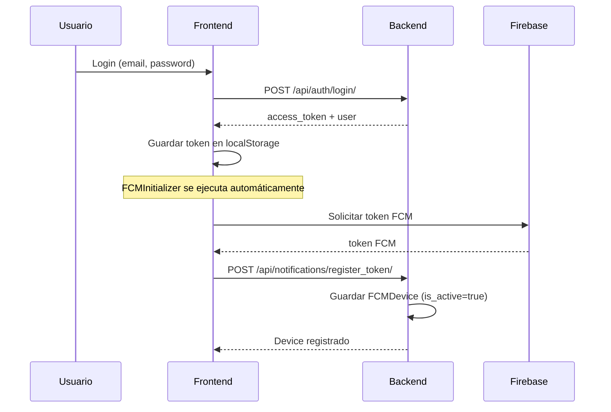
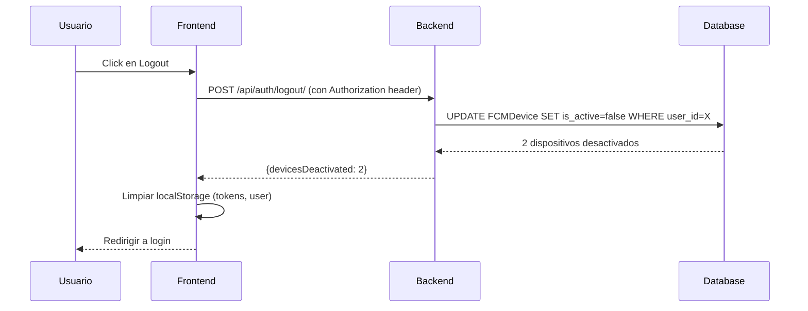
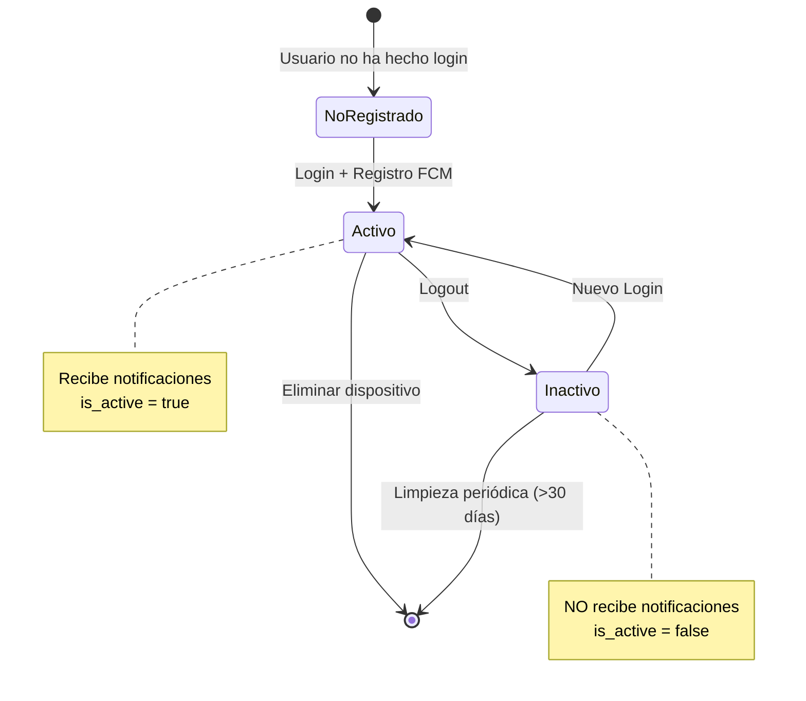

# 🔐 Gestión del Ciclo de Vida de Dispositivos FCM

## 📋 Resumen

Este documento describe cómo el sistema TrafiSmart gestiona los dispositivos FCM (Firebase Cloud Messaging) durante el ciclo de vida de la sesión del usuario: **registro en login** y **desactivación en logout**.

---

## 🎯 Objetivos

1. **Seguridad**: Los dispositivos no deben recibir notificaciones después del logout
2. **Recursos**: Evitar enviar notificaciones a tokens inválidos o sesiones cerradas
3. **UX**: El usuario debe recibir notificaciones solo en dispositivos con sesión activa

---

## 🔄 Flujo Completo

### 1. Login → Registro Automático de Dispositivo



**Archivos involucrados:**
- ✅ `frontend/src/services/fcm.service.ts` - `getToken()`, `registerToken()`
- ✅ `frontend/src/components/notifications/FCMInitializer.tsx` - Registro automático
- ✅ `backend/apps/notifications_app/views.py` - `register_token` action

---

### 2. Logout → Desactivación de Dispositivos



**Archivos involucrados:**
- ✅ `backend/apps/auth_app/views.py` - `LogoutView`
- ✅ `frontend/src/services/auth.service.ts` - `logout()` async
- ✅ `frontend/src/hooks/useAuth.ts` - `logout()` actualizado

---

## 📂 Cambios Realizados

### Backend

#### 1. **`apps/auth_app/views.py`** - Nueva vista `LogoutView`

```python
class LogoutView(APIView):
    """
    Logout endpoint: POST /api/auth/logout/
    
    Desactiva todos los dispositivos FCM asociados al usuario.
    """
    permission_classes = [IsAuthenticated]

    def post(self, request):
        user = request.user
        devices_count = 0
        
        # Desactivar dispositivos FCM
        if FCM_AVAILABLE:
            devices = FCMDevice.objects.filter(user=user, is_active=True)
            devices_count = devices.count()
            if devices_count > 0:
                devices.update(is_active=False)
                print(f"✓ Logout [{user.email}]: {devices_count} dispositivos desactivados")
        
        return Response({
            "message": f"Logout exitoso. Dispositivos desactivados: {devices_count}",
            "devicesDeactivated": devices_count
        })
```

**Características:**
- ✅ Requiere autenticación (`IsAuthenticated`)
- ✅ Desactiva **todos** los dispositivos del usuario
- ✅ No elimina dispositivos (solo marca `is_active=False`)
- ✅ Devuelve cantidad de dispositivos desactivados
- ✅ No falla si FCM no está disponible

#### 2. **`apps/auth_app/urls.py`** - Ruta activada

```python
urlpatterns = [
    # ... otras rutas
    path("logout/", views.LogoutView.as_view(), name="logout"),
]
```

---

### Frontend

#### 1. **`services/auth.service.ts`** - Logout asíncrono

**Antes:**
```typescript
logout(): void {
  localStorage.removeItem('access_token');
  localStorage.removeItem('refresh_token');
  localStorage.removeItem('user');
}
```

**Después:**
```typescript
async logout(): Promise<void> {
  try {
    // Llamar al endpoint de logout para desactivar dispositivos FCM
    await api.post('/api/auth/logout/');
    console.log('✓ Logout exitoso - dispositivos FCM desactivados');
  } catch (error) {
    console.warn('⚠️ Error al desactivar dispositivos FCM:', error);
  } finally {
    // Siempre limpiar localStorage
    localStorage.removeItem('access_token');
    localStorage.removeItem('refresh_token');
    localStorage.removeItem('user');
    localStorage.removeItem('token_expires_at');
    localStorage.removeItem('remember_me');
  }
}
```

**Características:**
- ✅ Llama al backend para desactivar dispositivos
- ✅ Siempre limpia localStorage (incluso si hay error)
- ✅ No bloquea el logout si el backend falla

#### 2. **`hooks/useAuth.ts`** - Logout asíncrono

```typescript
const logout = async () => {
  try {
    await authService.logout();  // ← Ahora es async
    setState({
      user: null,
      isAuthenticated: false,
      isLoading: false,
      error: null,
    });
  } catch (error) {
    console.error('Logout error:', error);
    // Force clear even if there's an error
    localStorage.clear();
  }
};
```

---

## 🧪 Pruebas

### Script de Prueba: `test_logout_flow.py`

```bash
cd backend
python scripts/test_logout_flow.py
```

**Verifica:**
1. ✅ Login exitoso
2. ✅ Registro de dispositivo FCM
3. ✅ Dispositivo está activo después del registro
4. ✅ Logout exitoso
5. ✅ Dispositivo está inactivo después del logout

**Salida esperada:**
```
================================================================================
  PASO 1: LOGIN
================================================================================
🔑 Intentando login con: juantadaymalan3@gmail.com
✅ Login exitoso
   Usuario: Juan Taday
   Token: eyJhbGciOiJIUzI1NiIsInR5cCI6IkpXVCJ9...

================================================================================
  PASO 2: REGISTRAR DISPOSITIVO FCM
================================================================================
📱 Registrando dispositivo...
✅ Dispositivo registrado exitosamente
   ID: 17
   Estado: Activo

================================================================================
  VERIFICACIÓN: Dispositivo después de registro
================================================================================
✅ Dispositivo 17 está ACTIVO (correcto)

================================================================================
  PASO 3: LOGOUT
================================================================================
🚪 Ejecutando logout...
✅ Logout exitoso
   Logout exitoso. Dispositivos desactivados: 1

================================================================================
  VERIFICACIÓN: Dispositivo después de logout
================================================================================
✅ Dispositivo 17 está INACTIVO (correcto)

================================================================================
  RESUMEN FINAL
================================================================================
✅ Login: OK
✅ Registro de dispositivo: OK (ID: 17)
✅ Logout: OK
✅ Desactivación de dispositivo: OK

Dispositivos del usuario:
  - Total: 2
  - Activos: 1
  - Inactivos: 1
```

---

## 🔍 Verificación en Base de Datos

### Ver dispositivos de un usuario

```sql
SELECT 
    id,
    user_id,
    device_name,
    device_type,
    is_active,
    created_at,
    updated_at
FROM notifications_app_fcmdevice
WHERE user_id = (SELECT id FROM auth_app_user WHERE email = 'juantadaymalan3@gmail.com')
ORDER BY updated_at DESC;
```

**Resultado esperado:**
```
id  | user_id | device_name              | device_type | is_active | updated_at
----|---------|--------------------------|-------------|-----------|-------------------
17  | 1       | Test Device - Logout     | web         | 0         | 2025-01-08 14:30:00
16  | 1       | Chrome - Windows         | web         | 1         | 2025-01-08 10:15:00
```

---

## 📊 Comportamiento del Sistema

### Envío de Notificaciones

El sistema **solo envía notificaciones a dispositivos activos**:

```python
# apps/notifications_app/views.py
def send_notification_to_user(user, title, body):
    devices = FCMDevice.objects.filter(
        user=user,
        is_active=True  # ← Solo dispositivos activos
    )
    
    for device in devices:
        send_fcm_notification(device.token, title, body)
```

### Reactivación en Nuevo Login

Cuando el usuario vuelve a hacer login:

1. **Frontend** registra automáticamente el dispositivo (`FCMInitializer`)
2. **Backend** verifica si el token ya existe:
   - Si existe **y está inactivo**: lo reactiva (`is_active=True`)
   - Si existe **y está activo**: lo deja como está
   - Si no existe: crea nuevo dispositivo

```python
# apps/notifications_app/views.py - register_token action
device, created = FCMDevice.objects.update_or_create(
    user=user,
    token=token,
    defaults={
        "deviceName": device_name,
        "deviceType": device_type,
        "is_active": True  # ← Reactiva si estaba inactivo
    }
)
```

---

## 🛡️ Consideraciones de Seguridad

### 1. **Token JWT en Logout**
- ✅ El endpoint `/api/auth/logout/` requiere autenticación
- ✅ El token JWT es necesario para identificar al usuario
- ✅ Después del logout, el token sigue siendo válido hasta su expiración (diseño JWT)

**Mitigación:**
- Frontend elimina el token del localStorage
- Backend implementa blacklist de tokens (opcional, para más seguridad)

### 2. **Dispositivos Compartidos**
- ✅ Si un usuario hace logout en un dispositivo compartido, **todos sus dispositivos se desactivan**
- ✅ Esto previene que el siguiente usuario del dispositivo compartido reciba notificaciones

**Alternativa (si se requiere):**
- Desactivar solo el dispositivo actual (requiere enviar `token` en body de logout)

### 3. **Limpieza de Dispositivos Antiguos**

Se recomienda tarea periódica para limpiar dispositivos inactivos:

```python
# Eliminar dispositivos inactivos por más de 30 días
from django.utils import timezone
from datetime import timedelta

cutoff_date = timezone.now() - timedelta(days=30)
FCMDevice.objects.filter(
    is_active=False,
    updated_at__lt=cutoff_date
).delete()
```

---

## 📝 API Reference

### POST `/api/auth/logout/`

**Descripción:** Cierra la sesión del usuario y desactiva todos sus dispositivos FCM.

**Headers:**
```json
{
  "Authorization": "Bearer <access_token>"
}
```

**Body:** `{}` (opcional, vacío)

**Response 200 OK:**
```json
{
  "message": "Logout exitoso. Dispositivos desactivados: 2",
  "devicesDeactivated": 2
}
```

**Response 401 Unauthorized:**
```json
{
  "detail": "Authentication credentials were not provided."
}
```

**Response 500 Internal Server Error:**
```json
{
  "error": "Error en logout: [mensaje de error]"
}
```

---

## 🔄 Diagrama de Estados del Dispositivo



---

## ✅ Checklist de Implementación

- [x] Backend: `LogoutView` creado
- [x] Backend: Ruta `/api/auth/logout/` activada
- [x] Backend: Import de `FCMDevice` con manejo de excepción
- [x] Frontend: `auth.service.ts` actualizado a async
- [x] Frontend: `useAuth.ts` actualizado a async
- [x] Script de prueba: `test_logout_flow.py` creado
- [x] Documentación: `FCM_DEVICE_LIFECYCLE.md` creado
- [ ] **PENDIENTE**: Ejecutar script de prueba
- [ ] **PENDIENTE**: Verificar en navegador (login → logout → no recibe notificaciones)
- [ ] **PENDIENTE**: Agregar tarea periódica de limpieza (Celery)

---

## 🚀 Próximos Pasos

1. **Ejecutar pruebas:**
   ```bash
   cd backend
   python scripts/test_logout_flow.py
   ```

2. **Verificar en navegador:**
   - Login → Registrar dispositivo
   - Logout
   - Intentar enviar notificación (no debe recibirse)
   - Login nuevamente → Dispositivo se reactiva

3. **Agregar limpieza periódica (opcional):**
   ```python
   # backend/config/celery.py
   @app.task
   def cleanup_inactive_devices():
       from apps.notifications_app.models import FCMDevice
       from django.utils import timezone
       from datetime import timedelta
       
       cutoff = timezone.now() - timedelta(days=30)
       deleted = FCMDevice.objects.filter(
           is_active=False,
           updated_at__lt=cutoff
       ).delete()
       
       return f"Eliminados {deleted[0]} dispositivos inactivos"
   ```

---

## 📚 Referencias

- [Firebase Cloud Messaging - Device Group Management](https://firebase.google.com/docs/cloud-messaging/manage-tokens)
- [Django REST Framework - Authentication](https://www.django-rest-framework.org/api-guide/authentication/)
- [JWT Token Blacklisting](https://django-rest-framework-simplejwt.readthedocs.io/en/latest/blacklist_app.html)

---

**Última actualización:** 2025-01-08  
**Autor:** TrafiSmart Development Team
