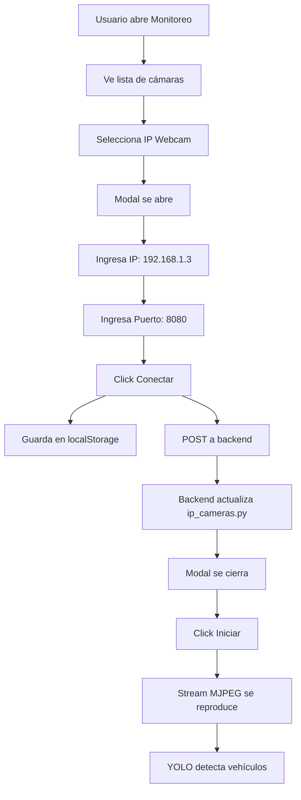

# 📱 IP Webcam - Configuración Completa

## ✅ Migración de DroidCam a IP Webcam

Se ha migrado completamente el sistema de **DroidCam** a **IP Webcam** para mejor estabilidad y flexibilidad.

---

## 📲 Paso 1: Instalar IP Webcam

1. **Desinstala DroidCam** (si lo tenías instalado)
   - Del celular: Desinstalar app
   - De la PC: Desinstalar drivers y software

2. **Instala IP Webcam**
   - Play Store: https://play.google.com/store/apps/details?id=com.pas.webcam
   - O busca "IP Webcam" en Play Store

---

## 🔧 Paso 2: Configurar IP Webcam

1. **Abre IP Webcam** en tu celular
2. **(Opcional) Ajusta configuraciones:**
   - Video resolution: 1280x720 o superior
   - Video quality: 80-100%
   - Video orientation: Auto o Landscape
3. **Baja hasta el final** y presiona **"Start server"**
4. **Anota la IP IPv4** que aparece en pantalla:
   ```
   IPv4: http://192.168.1.3:8080
   ```

---

## 🌐 Paso 3: Usar en la aplicación TrafiSmart

### **Frontend (Página de Monitoreo)**

1. Abre la página de **Monitoreo en Vivo**
2. En el selector de cámaras verás: **"📱 IP Webcam (Celular)"**
3. **Selecciona esa opción** → Se abrirá un modal
4. **Ingresa los datos:**
   - **IP**: `192.168.1.3` (la que muestra tu app)
   - **Puerto**: `8080` (por defecto)
5. **Click en "✅ Conectar"**
6. **Click en "Iniciar"** para ver el stream

### **¿Qué pasa al dar "Conectar"?**

El sistema automáticamente:
- ✅ Guarda la IP en localStorage (frontend)
- ✅ Actualiza el archivo `backend/config/ip_cameras.py`
- ✅ La configuración persiste entre recargas de página

---

## 🔄 Cambio de Red WiFi

**Si cambias de red WiFi**, solo necesitas:

1. Seleccionar nuevamente **"📱 IP Webcam (Celular)"**
2. El modal se abrirá con la IP anterior
3. Ingresa la **nueva IP**
4. Click "✅ Conectar"
5. Listo! ✅

**Ya NO necesitas editar código manualmente** 🎉

---

## 📂 Archivos Modificados

### **Frontend:**
- `frontend/src/pages/monitoring/LiveMonitoring.tsx`
  - Agregado: Opción fija "📱 IP Webcam (Celular)"
  - Eliminado: Detección automática de DroidCam USB
  - Storage: `localStorage.setItem('ipWebcamUrl', ...)`

- `frontend/src/components/traffic/IPCameraConfigModal.tsx`
  - Actualizado: Mensajes de "DroidCam" → "IP Webcam"
  - Puerto por defecto: `8080` (antes 4747)
  - Placeholders: IPs de ejemplo actualizadas

### **Backend:**
- `backend/config/ip_cameras.py`
  - ID cambiado: `"ipwebcam"` (antes "droidcam")
  - URL inicial: `http://192.168.1.3:8080/video`
  - Type: `"ipwebcam"`

- `backend/apps/streaming/views.py`
  - Endpoint: `POST /api/streaming/update-ip-camera/`
  - Actualiza automáticamente `ip_cameras.py` con regex
  - Acepta: `camera_id: "ipwebcam"`, `ip_address`, `port`, `video_url`

---

## 🎯 Ventajas de IP Webcam sobre DroidCam

| Característica | DroidCam | IP Webcam |
|----------------|----------|-----------|
| Stream IP directo | ❌ | ✅ |
| Aparece como USB | ✅ | ❌ |
| Puerto estándar | 4747 | 8080 |
| API REST | ❌ | ✅ |
| Múltiples formatos | MJPEG | MJPEG, H264, WebRTC |
| Configuración web | ❌ | ✅ |
| Estabilidad | Media | Alta |

---

## 🔍 URLs Disponibles en IP Webcam

Cuando IP Webcam está en `192.168.1.3:8080`:

```bash
# Video MJPEG (el que usamos)
http://192.168.1.3:8080/video

# Vista en navegador
http://192.168.1.3:8080

# RTSP H264 (para apps nativas)
rtsp://192.168.1.3:8080/h264_ulaw.sdp

# Snapshot
http://192.168.1.3:8080/shot.jpg
```

---

## ⚙️ Configuración IP Webcam (Recomendada)

Para mejor calidad en TrafiSmart:

```
Video preferences:
  - Resolution: 1280x720
  - Quality: 90%
  - Video orientation: Landscape
  - FPS limit: 30

Audio Mode: Off (no necesario para detección)

Connection:
  - Port: 8080 (default)
  - Login/Password: (opcional, dejar vacío)
```

---

## 🐛 Solución de Problemas

### ❌ "No se pudo conectar"

**Verifica:**
1. IP Webcam dice **"Running"** en el celular
2. Ambos dispositivos en la **misma red WiFi**
3. La IP es correcta (aparece en pantalla del celular)
4. No hay firewall bloqueando puerto 8080

### ❌ "Error 400 Bad Request"

El backend necesita recibir todos los campos:
- `camera_id`: "ipwebcam"
- `ip_address`: "192.168.1.3"
- `port`: 8080
- `video_url`: "http://192.168.1.3:8080/video"

### ❌ Stream se corta o congela

1. Reduce la resolución en IP Webcam
2. Baja la calidad a 70-80%
3. Verifica señal WiFi fuerte
4. Cierra otras apps en el celular

---

## 📝 Notas Técnicas

### **localStorage Keys**
```javascript
// IP Webcam URL guardada
localStorage.getItem('ipWebcamUrl')
// Retorna: "http://192.168.1.3:8080/video"
```

### **Backend API**
```bash
# Actualizar IP de cámara
POST http://localhost:8001/api/streaming/update-ip-camera/

# Body:
{
  "camera_id": "ipwebcam",
  "ip_address": "192.168.1.3",
  "port": 8080,
  "video_url": "http://192.168.1.3:8080/video"
}

# Response:
{
  "success": true,
  "message": "Configuración de IP actualizada",
  "config": { ... }
}
```

---

## ✨ Flujo Completo



---

## 🎉 ¡Listo!

Ahora tu sistema funciona con **IP Webcam** y puedes cambiar de red WiFi fácilmente sin tocar código.

**Configuración anterior IP:** `192.168.1.3:8080`
