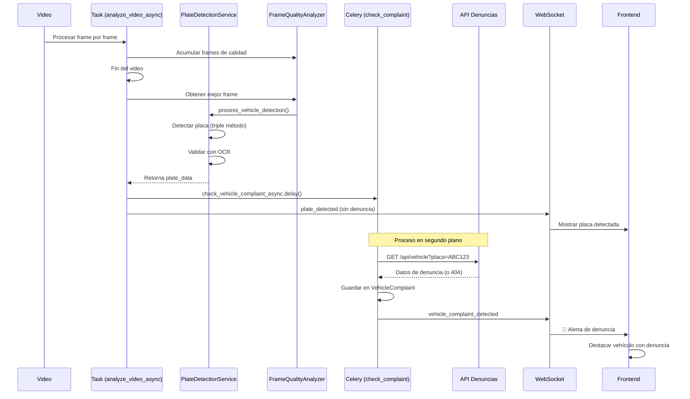

# 🚗 Flujo de Detección de Placas y Consulta de Denuncias

## 📋 Resumen Ejecutivo

Este documento analiza el flujo completo de detección de placas vehiculares en TrafiSmart y determina **el punto exacto** donde se debe implementar la consulta a la API de denuncias gubernamentales.

---

## 🔍 Análisis del Flujo Actual

### 1️⃣ **Inicio del Análisis de Tráfico**
**Archivo**: `backend/apps/traffic_app/tasks.py`  
**Función**: `analyze_video_async()`

```python
@shared_task(bind=True, max_retries=3)
def analyze_video_async(self, analysis_id, video_path):
    # Se procesa el video frame por frame
    # Se detectan vehículos con YOLO
    # Se rastrean vehículos con tracking
```

---

### 2️⃣ **Acumulación de Frames de Calidad**
Durante el procesamiento del video, se acumulan múltiples frames de cada vehículo para seleccionar el mejor:

```python
# Se usa FrameQualityAnalyzer para acumular frames
frame_analyzer.add_frame(
    track_id=vehicle_id,
    frame=frame,
    bbox=bbox,
    frame_number=frame_count
)
```

**Criterios de calidad evaluados**:
- ✨ Nitidez (40%)
- 📏 Tamaño del bbox (30%)
- 🎯 Centralidad (20%)
- 💡 Iluminación (10%)

---

### 3️⃣ **Procesamiento de Placas (Mejor Frame)**
**Archivo**: `backend/apps/traffic_app/tasks.py` (líneas 500-552)

Después de procesar todo el video, se procesan las placas usando el **mejor frame** de cada vehículo:

```python
for vehicle_id, vehicle_data in tracked_vehicles.items():
    # Obtener el mejor frame
    best_frame_data = frame_analyzer.get_best_frame(vehicle_id)
    
    # Procesar detección de placa
    plate_data = plate_service.process_vehicle_detection(
        frame=best_frame_data['roi'],
        vehicle_id=vehicle_id,
        vehicle_type=vehicle_data['type'],
        video_name=video_name,
        analysis_id=analysis_id
    )
```

---

### 4️⃣ **Detección de Placa (Triple Método)**
**Archivo**: `backend/apps/traffic_app/services/plate_detection_service.py`  
**Función**: `process_vehicle_detection()`

#### Proceso completo:

1. **Guardar ROI del vehículo**
2. **Detectar candidatos de placas** (triple método):
   - 🎯 Roboflow API (Prioridad 1 - IA especializada 85-95% precisión)
   - 📸 Haarcascade (Fallback 1)
   - 🔲 Contornos + Aspect Ratio (Fallback 2)
   - 🎨 Detección por Color HSV (Fallback 3)

3. **Validar cada candidato con OCR**:
   ```python
   for idx, (x, y, w, h) in enumerate(plate_candidates):
       candidate_roi = frame[y:y+h, x:x+w]
       
       # OCR con EasyOCR
       text, conf = self.read_plate_text(candidate_roi)
       
       if self._validate_plate_text(text):
           valid_plates.append({
               'bbox': (x, y, w, h),
               'text': text,
               'confidence': conf,
               'roi': candidate_roi
           })
   ```

4. **Elegir la placa con mayor confianza**:
   ```python
   best_plate = max(valid_plates, key=lambda p: p['confidence'])
   plate_text = best_plate['text']
   confidence = best_plate['confidence']
   ```

5. **Guardar imagen de placa y JSON**

6. **Retornar datos de la placa** 📍 **PUNTO CRÍTICO**

---

## 🎯 **PUNTO EXACTO DE TERMINACIÓN DE DETECCIÓN**

### 📍 **Ubicación**: `backend/apps/traffic_app/services/plate_detection_service.py`
### 📍 **Función**: `process_vehicle_detection()`
### 📍 **Líneas**: ~840-860

```python
# Guardar en JSON
self._save_detection_to_json(
    video_name=video_name,
    vehicle_id=vehicle_id,
    vehicle_type=vehicle_type,
    plate_number=plate_text,
    confidence=confidence,
    detection_method="triple",
    image_path=plate_image_path,
    analysis_id=analysis_id
)

# ✅ AQUÍ TERMINA LA DETECCIÓN - RETORNA DATOS DE LA PLACA
return {
    'vehicle_id': vehicle_id,
    'vehicle_type': vehicle_type,
    'plate_number': plate_text,           # 🔥 PLACA DETECTADA
    'confidence': confidence,
    'detection_method': "triple",
    'plate_image_path': plate_image_path,
    'vehicle_image_path': vehicle_image_path,
    'timestamp': datetime.now().isoformat()  # ⚠️ AGREGAR ESTO
}
```

---

## 🚀 **PUNTO ÓPTIMO PARA CONSULTAR API DE DENUNCIAS**

### **Opción 1: Consulta Síncrona (Inmediata)** ⚡
**Ubicación**: `backend/apps/traffic_app/tasks.py` (línea ~530)

```python
if plate_data:
    platesDetected += 1
    if plate_data.get('plate_number') not in ['NOT_DETECTED', 'NO_OCR', 'ERROR', 'UNREADABLE']:
        platesCaptured += 1
        
        # 🔥 AQUÍ: Consultar API de denuncias
        complaint_data = await check_vehicle_complaints(
            plate_number=plate_data['plate_number'],
            vehicle_type=plate_data['vehicle_type'],
            analysis_id=analysis_id
        )
        
        # Enviar notificación WebSocket CON datos de denuncia
        send_ws("plate_detected", {
            "vehicle_id": str(vehicle_id),
            "vehicle_type": vehicle_data['type'],
            "plate_number": plate_data['plate_number'],
            "confidence": plate_data['confidence'],
            "timestamp": plate_data['timestamp'],
            "frame_number": best_frame_data['frame_number'],
            "quality_score": best_frame_data['quality_score'],
            # 🚨 DATOS DE DENUNCIA
            "has_complaint": complaint_data is not None,
            "complaint_details": complaint_data
        })
```

**Ventajas**:
- ✅ Respuesta inmediata
- ✅ Notificación en tiempo real al frontend
- ✅ Datos completos en una sola notificación

**Desventajas**:
- ❌ Puede ralentizar el procesamiento del video
- ❌ Si la API está lenta, bloquea el flujo

---

### **Opción 2: Consulta Asíncrona (Background Task)** 🔄 ⭐ **RECOMENDADO**
**Ubicación**: Nueva tarea Celery

```python
# backend/apps/traffic_app/tasks.py

@shared_task(bind=True, max_retries=3)
def check_vehicle_complaint_async(self, plate_number, vehicle_id, vehicle_type, analysis_id):
    """
    🚨 Consulta API de denuncias en segundo plano
    
    Args:
        plate_number: Placa detectada (ej: "ABC-1234")
        vehicle_id: ID del vehículo rastreado
        vehicle_type: Tipo de vehículo (car, truck, etc.)
        analysis_id: ID del análisis de tráfico
    """
    try:
        import requests
        from apps.traffic_app.models import VehicleComplaint
        
        logger.info(f"🔍 Consultando denuncias para placa: {plate_number}")
        
        # Llamar a API gubernamental
        api_url = settings.GOV_VEHICLE_API_URL  # http://localhost:7000/api/vehicle
        response = requests.get(
            api_url,
            params={'placa': plate_number},
            timeout=10
        )
        
        if response.status_code == 404:
            # Placa no encontrada - sin denuncias
            logger.info(f"✅ Placa {plate_number}: Sin denuncias")
            return {
                'plate_number': plate_number,
                'has_complaint': False
            }
        
        response.raise_for_status()
        data = response.json()
        
        # Guardar denuncia en base de datos
        complaint = VehicleComplaint.objects.create(
            analysis_id=analysis_id,
            vehicle_id=vehicle_id,
            vehicle_type=vehicle_type,
            plate_number=plate_number,
            owner_name=data['propietario']['nombre'],
            owner_id=data['propietario']['cedula'],
            address=data['ubicacion']['direccion'],
            complaints=data['denuncias'],
            case_number=data['expediente'],
            detected_at=timezone.now()
        )
        
        logger.warning(f"🚨 DENUNCIA ENCONTRADA: {plate_number}")
        
        # Notificar al frontend vía WebSocket
        channel_layer = get_channel_layer()
        room_group_name = f"traffic_analysis_{analysis_id}"
        
        async_to_sync(channel_layer.group_send)(
            room_group_name,
            {
                "type": "vehicle_complaint_detected",
                "data": {
                    "vehicle_id": vehicle_id,
                    "plate_number": plate_number,
                    "owner_name": data['propietario']['nombre'],
                    "complaints": data['denuncias'],
                    "case_number": data['expediente'],
                    "timestamp": complaint.detected_at.isoformat()
                }
            }
        )
        
        return {
            'plate_number': plate_number,
            'has_complaint': True,
            'complaint_id': complaint.id
        }
        
    except requests.RequestException as e:
        logger.error(f"❌ Error consultando API: {e}")
        # Reintentar después de 30 segundos
        raise self.retry(exc=e, countdown=30)
    
    except Exception as e:
        logger.error(f"❌ Error procesando denuncia: {e}")
        raise
```

**Llamar la tarea desde el punto de detección**:

```python
# backend/apps/traffic_app/tasks.py (línea ~530)

if plate_data:
    platesDetected += 1
    if plate_data.get('plate_number') not in ['NOT_DETECTED', 'NO_OCR', 'ERROR', 'UNREADABLE']:
        platesCaptured += 1
        
        # 🔥 Lanzar consulta de denuncias en segundo plano
        check_vehicle_complaint_async.delay(
            plate_number=plate_data['plate_number'],
            vehicle_id=str(vehicle_id),
            vehicle_type=vehicle_data['type'],
            analysis_id=analysis_id
        )
        
        # Enviar notificación básica
        send_ws("plate_detected", {
            "vehicle_id": str(vehicle_id),
            "vehicle_type": vehicle_data['type'],
            "plate_number": plate_data['plate_number'],
            "confidence": plate_data['confidence'],
            "timestamp": plate_data.get('timestamp'),
            "frame_number": best_frame_data['frame_number'],
            "quality_score": best_frame_data['quality_score']
        })
```

**Ventajas**:
- ✅ No bloquea el procesamiento del video
- ✅ Reintentos automáticos si la API falla
- ✅ Escalable (múltiples consultas en paralelo)
- ✅ Separación de responsabilidades

**Desventajas**:
- ⚠️ Respuesta no inmediata (segundos de retraso)
- ⚠️ Requiere Celery corriendo

---

## 📊 **Modelo de Datos Sugerido**

```python
# backend/apps/traffic_app/models.py

class VehicleComplaint(models.Model):
    """
    Registro de vehículos con denuncias detectados en análisis
    """
    analysis = models.ForeignKey(
        'TrafficAnalysis', 
        on_delete=models.CASCADE,
        related_name='vehicle_complaints'
    )
    vehicle_id = models.CharField(max_length=20)  # Track ID
    vehicle_type = models.CharField(max_length=20)
    plate_number = models.CharField(max_length=20, db_index=True)
    
    # Datos del propietario
    owner_name = models.CharField(max_length=200)
    owner_id = models.CharField(max_length=20)  # Cédula
    address = models.TextField()
    
    # Denuncias
    complaints = models.JSONField()  # Lista de denuncias
    case_number = models.CharField(max_length=50)  # Expediente
    
    # Timestamps
    detected_at = models.DateTimeField(auto_now_add=True)
    notified = models.BooleanField(default=False)
    
    class Meta:
        db_table = 'traffic_vehicle_complaints'
        ordering = ['-detected_at']
        indexes = [
            models.Index(fields=['plate_number', '-detected_at']),
            models.Index(fields=['analysis', 'notified']),
        ]
    
    def __str__(self):
        return f"{self.plate_number} - {self.case_number}"
```

---

## 🔧 **Configuración Necesaria**

### 1. **Variables de entorno** (`.env`)

```bash
# API de denuncias gubernamentales
GOV_VEHICLE_API_URL=http://localhost:7000/api/vehicle
GOV_VEHICLE_API_TIMEOUT=10
GOV_VEHICLE_API_RETRY_TIMES=3
```

### 2. **Settings de Django**

```python
# backend/config/settings.py

# API de Denuncias Vehiculares
GOV_VEHICLE_API_URL = os.getenv('GOV_VEHICLE_API_URL', 'http://localhost:7000/api/vehicle')
GOV_VEHICLE_API_TIMEOUT = int(os.getenv('GOV_VEHICLE_API_TIMEOUT', '10'))
GOV_VEHICLE_API_RETRY_TIMES = int(os.getenv('GOV_VEHICLE_API_RETRY_TIMES', '3'))
```

---

## 🎯 **Flujo Completo Propuesto**



---

## 📝 **Resumen**

### ✅ **Punto exacto de terminación de detección**:
- **Archivo**: `backend/apps/traffic_app/services/plate_detection_service.py`
- **Función**: `process_vehicle_detection()`
- **Línea**: ~860 (return statement)

### ✅ **Punto óptimo para consultar API**:
- **Archivo**: `backend/apps/traffic_app/tasks.py`
- **Función**: `analyze_video_async()`
- **Línea**: ~535 (después de validar plate_data)
- **Método**: Tarea Celery asíncrona (`check_vehicle_complaint_async.delay()`)

### ✅ **Ventajas del enfoque asíncrono**:
1. No bloquea el procesamiento del video
2. Reintentos automáticos en caso de fallo
3. Notificaciones en tiempo real vía WebSocket
4. Escalable y mantenible

---

## 📚 **Próximos Pasos**

1. ✅ Crear modelo `VehicleComplaint`
2. ✅ Crear tarea Celery `check_vehicle_complaint_async`
3. ✅ Integrar llamada en `analyze_video_async`
4. ✅ Actualizar WebSocket consumer para `vehicle_complaint_detected`
5. ✅ Actualizar frontend para mostrar alertas de denuncias
6. ✅ Configurar variables de entorno
7. ✅ Crear tests unitarios

---

**Fecha**: 4 de noviembre de 2025  
**Autor**: GitHub Copilot  
**Versión**: 1.0
