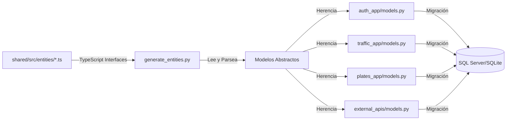

# SIMPTV - Sistema Inteligente de Monitoreo y Predicción de Tráfico Vehicular

Sistema completo de análisis de tráfico con detección de placas y predicción usando Machine Learning.

**Proyecto de Investigación - Universidad de Milagro**  
Carrera de Ingeniería en Software - 5to Semestre

## 🚀 Descripción del Proyecto

Este sistema permite analizar videos de tráfico para:
- Detectar y contar vehículos
- Identificar placas de matrícula usando tecnologías de visión computacional
- Generar predicciones de tráfico con Machine Learning
- Gestionar usuarios con múltiples roles y permisos
- Monitorear tráfico en tiempo real
- Sistema de notificaciones y alertas

## 🏗️ Arquitectura del Sistema

El proyecto está estructurado como un **monorepo** con 3 módulos independientes pero interconectados:

```
SIMPTV/
├── shared/          # Librerías compartidas (TypeScript)
├── backend/         # API REST con Django (Python)
├── frontend/        # Dashboard web con React (TypeScript)
├── README.md        # Este archivo
├── .gitignore       # Archivos a ignorar en Git
└── package.json     # Scripts del monorepo
```

### 🔄 Flujo de Sincronización de Modelos



**Proceso:**
1. 📝 Desarrollador define interfaces en `shared/src/entities/` (TypeScript)
2. 🔧 Ejecuta `python manage.py generate_entities`
3. ✨ Script genera modelos abstractos en `apps/entities/models/`
4. 🎯 Cada app hereda y extiende los modelos según necesidad
5. 🗃️ Django crea las tablas en la base de datos

**Ventajas:**
- ✅ **Single Source of Truth**: Interfaces TypeScript como fuente única
- ✅ **Sincronización automática**: No hay inconsistencias entre frontend/backend
- ✅ **Tipo-seguridad**: Validación en TypeScript y Python
- ✅ **DRY Principle**: No duplicar definiciones de modelos
- ✅ **Mantenibilidad**: Cambios se propagan automáticamente

## 📦 Módulos del Sistema

### 🔗 Shared Library (TypeScript)
- **Propósito**: Tipos, esquemas y constantes compartidas entre frontend y backend
- **Tecnologías**: 
  - TypeScript 5.0+
  - Zod 3.22+ (validación de esquemas)
  - tsup 8.5+ (bundling)
  - date-fns 2.30+ (manejo de fechas)
- **Estructura**:
  ```
  shared/src/
  ├── dto/             # Data Transfer Objects
  ├── entities/        # Entidades del sistema
  ├── models/          # Modelos de datos
  ├── schemas/         # Esquemas de validación Zod
  └── types/           # Tipos TypeScript
  ```
- **Características**:
  - Distribución multi-formato (CJS/ESM)
  - Tipado estático completo
  - Validación de datos en tiempo de ejecución
  - Compatible con Node.js y browsers

### 🐍 Backend (Python/Django)
- **Propósito**: API REST robusta con procesamiento de ML y gestión de datos
- **Framework**: Django 5.2 con Django REST Framework 3.15+
- **Base de Datos**: SQL Server con mssql-django 1.6
- **Arquitectura**: **API REST con patrón DLL (Data Layer Library)**
- **Tecnologías Principales**:
  - **Autenticación**: djangorestframework-simplejwt 5.3+
  - **CORS**: django-cors-headers 4.4+
  - **Documentación**: drf-spectacular 0.27+
  - **Testing**: pytest 8.1+ con pytest-django 4.8+
  - **Code Quality**: black 24.3+, flake8 7.0+, ruff 0.3+
- **Estructura**:
  ```
  backend/
  ├── apps/
  │   ├── entities/           # ⭐ DLL - Modelos abstractos generados automáticamente
  │   │   ├── models/         # Modelos base abstractos (BaseModel, UserEntity, etc.)
  │   │   ├── constants/      # Constantes compartidas (roles, estados, etc.)
  │   │   └── management/
  │   │       └── commands/
  │   │           └── generate_entities.py  # Script generador de modelos
  │   ├── auth_app/          # App 1: Autenticación y usuarios (hereda de entities)
  │   ├── traffic_app/       # App 2: Análisis de tráfico (hereda de entities)
  │   ├── plates_app/        # App 3: Detección de placas (hereda de entities)
  │   └── external_apis/     # App 4: Integración con APIs externas
  ├── config/                 # Configuración Django
  ├── logs/                   # Archivos de log
  ├── media/                  # Archivos multimedia
  ├── scripts/                # Scripts utilitarios
  └── utils/                  # Utilidades compartidas
  ```
- **Características Arquitectónicas**:
  - ✅ **API REST pura** (sin templates, solo JSON responses)
  - ✅ **DLL Pattern**: Modelos abstractos en `entities/`, implementaciones concretas en apps
  - ✅ **Auto-generación**: Script `generate_entities.py` lee TypeScript de `shared/` y genera modelos Django
  - ✅ **4 Apps especializadas**: Cada app se enfoca en un dominio específico
  - ✅ **Herencia de modelos**: Apps heredan de entidades abstractas (`UserEntity`, `TrafficEntity`, etc.)
  - ✅ **Sincronización automática**: Modelos Python sincronizados con TypeScript interfaces
  - ✅ **Constantes centralizadas**: Roles, estados y enums en `entities/constants/`
  - ✅ **Autenticación JWT** con refresh tokens
  - ✅ **Documentación OpenAPI 3.0** automática
  - ✅ **Soporte SQL Server y SQLite** (desarrollo)

#### 🔧 **Patrón DLL (Data Layer Library)**
```python
# entities/models/auth.py - Modelo abstracto (DLL)
class UserEntity(BaseModel):
    """Modelo abstracto generado desde TypeScript"""
    email = models.EmailField(max_length=255)
    passwordHash = models.CharField(max_length=255)
    firstName = models.CharField(max_length=255)
    lastName = models.CharField(max_length=255)
    phoneNumber = models.CharField(max_length=20, blank=True, null=True)
    emailConfirmed = models.BooleanField(default=False)
    
    class Meta:
        abstract = True  # ← Modelo abstracto, no crea tabla

# auth_app/models.py - Implementación concreta (App)
class User(UserEntity):
    """Modelo concreto que hereda de UserEntity"""
    last_login = models.DateTimeField(null=True, blank=True)
    failed_login_attempts = models.IntegerField(default=0)
    is_locked_out = models.BooleanField(default=False)
    
    class Meta:
        db_table = "auth_users"  # ← Tabla real en BD
        
    def __str__(self):
        return f"{self.firstName} {self.lastName}"
```

#### 📝 **Generación Automática de Modelos**
```bash
# 1. Modelos TypeScript en shared/src/entities/
interface UserEntity {
    id: string;
    email: string;
    firstName: string;
    lastName: string;
    // ...
}

# 2. Script lee TypeScript y genera Python
python manage.py generate_entities

# 3. Resultado en apps/entities/models/auth.py
class UserEntity(BaseModel):
    email = models.EmailField(max_length=255)
    firstName = models.CharField(max_length=255)
    lastName = models.CharField(max_length=255)
    # Auto-generado ✨
```

#### 🔗 **Las 4 Apps Internas**
1. **entities/** - Librería de modelos abstractos (DLL)
2. **auth_app/** - Autenticación, usuarios, roles y permisos
3. **traffic_app/** - Análisis de tráfico, videos, métricas
4. **plates_app/** - Detección de placas, OCR, reportes
5. **external_apis/** - Integración con servicios externos (Gmail, Twilio, etc.)

### ⚛️ Frontend (React/TypeScript)
- **Propósito**: Interfaz web moderna y responsiva para gestión y visualización
- **Framework**: React 18.2+ con TypeScript 5.2+
- **Build Tool**: Vite 5.0+ (desarrollo y producción)
- **Tecnologías Principales**:
  - **Routing**: React Router DOM 6.18+
  - **State Management**: Zustand 4.4+ y React Query 5.8+
  - **Forms**: React Hook Form 7.47+ con Zod resolvers
  - **Styling**: Tailwind CSS 3.3+
  - **Icons**: Lucide React 0.292+
  - **Charts**: Recharts 2.8+
  - **HTTP Client**: Axios 1.6+
  - **WebSockets**: Socket.io Client 4.7+
  - **Notifications**: React Hot Toast 2.4+
- **Estructura**:
  ```
  frontend/src/
  ├── components/          # Componentes reutilizables
  │   ├── auth/           # Componentes de autenticación
  │   ├── layout/         # Layout y navegación
  │   ├── notifications/  # Sistema de notificaciones
  │   ├── plates/         # Detección de placas
  │   ├── traffic/        # Monitoreo de tráfico
  │   └── ui/             # Componentes UI base
  ├── hooks/              # Custom React hooks
  ├── pages/              # Páginas de la aplicación
  ├── services/           # Servicios API
  ├── stores/             # Estado global (Zustand)
  ├── types/              # Tipos TypeScript
  └── utils/              # Utilidades
  ```
- **Características**:
  - Arquitectura basada en componentes
  - Gestión de estado reactivo
  - Routing protegido por roles
  - Interfaz responsive con Tailwind CSS
  - Desarrollo con HMR y TypeScript estricto

## 🛠️ Configuración de la Base de Datos

### SQL Server (Configuración Principal)
```env
# Configuración en backend/.env
DB_NAME=UrbiaDb
DB_USER=xxxxxxx
DB_PASSWORD=xxxxxxx
DB_HOST=xxxxxxx
DB_PORT=1433
```

### SQLite (Desarrollo alternativo)
```env
# Para usar SQLite en desarrollo
USE_SQLITE=True
```

### Usuario Administrador por Defecto
```
Email: admin@gmail.com
Password: xxxxxxx
Roles: ADMIN
```

## 🚀 Instalación y Ejecución

### Requisitos del Sistema
- **Node.js**: ≥18.0.0
- **Python**: ≥3.9.0
- **npm**: ≥8.0.0
- **SQL Server** (opcional: SQLite para desarrollo)

### 1. Instalación Completa (Recomendado)

```bash
# Instalar todo automáticamente
npm run setup

# O paso a paso:
npm run install:all        # Instala todas las dependencias
npm run build:shared       # Construye la librería compartida
npm run db:generate         # Genera modelos de Django
npm run db:push            # Aplica migraciones
npm run db:seed            # Carga datos iniciales
```

### 2. Instalación por Módulos

```bash
# Shared library
cd shared && npm install && npm run build

# Backend (Python/Django)
cd backend && pip install -r requirements.txt

# Frontend (React/TypeScript)
cd frontend && npm install
```

### 3. Configuración de Base de Datos

```bash
# Generar modelos Django desde TypeScript (IMPORTANTE)
cd backend
python manage.py generate_entities  # ← Auto-genera entities/models/*.py

# Crear migraciones
python manage.py makemigrations

# Aplicar migraciones
python manage.py migrate

# Crear usuario administrador
python manage.py seed_admin  # Email: admin@gmail.com, Password: admin123

# O crear superusuario personalizado (opcional)
python manage.py createsuperuser
```

### 4. Ejecutar en Desarrollo

```bash
# Backend Django (Puerto 8000)
npm run dev:backend
# O manualmente:
cd backend && python manage.py runserver

# Frontend React + Vite (Puerto 5173)  
npm run dev:frontend
# O manualmente:
cd frontend && npm run dev

# Builds de producción
npm run build:all
```

### 5. Scripts Disponibles

```bash
# Desarrollo
npm run dev:backend         # Ejecutar Django dev server
npm run dev:frontend        # Ejecutar Vite dev server

# Build y producción
npm run build:shared        # Build shared library
npm run build:frontend      # Build frontend para producción  
npm run build:all          # Build completo

# Testing y calidad
npm run lint:all           # Linting de todo el código
npm run type-check:all     # Verificación de tipos TypeScript
npm run test:all           # Ejecutar todos los tests

# Utilidades
npm run clean:all          # Limpiar archivos generados
npm run db:reset           # Resetear base de datos
```

## 📋 Funcionalidades del Sistema

### 🔐 Sistema de Autenticación
- **Multi-rol**: ADMIN, OPERATOR, VIEWER con permisos granulares
- **JWT Security**: Tokens de acceso y refresh con djangorestframework-simplejwt
- **Sesión persistente**: "Recordar contraseña" con localStorage/sessionStorage
- **Protección de rutas**: ProtectedRoute components en React
- **Gestión de usuarios**: CRUD completo con validación de roles

### 🚗 Monitoreo de Tráfico
- **Análisis en tiempo real**: Procesamiento de videos de tráfico
- **Dashboard interactivo**: Visualización de métricas y estadísticas
- **Detección de vehículos**: Algoritmos de visión computacional
- **Conteo automático**: Clasificación y conteo por tipo de vehículo
- **Reportes**: Generación de reportes detallados de tráfico

### 🔍 Sistema de Detección de Placas
- **Reconocimiento OCR**: Lectura automática de placas vehiculares
- **Base de datos**: Almacenamiento y consulta de placas detectadas
- **Búsqueda avanzada**: Filtros por fecha, ubicación, y características
- **Historial completo**: Tracking de placas con timestamps
- **Validación**: Sistema de verificación manual de detecciones

### 📊 Análisis Predictivo
- **Machine Learning**: Modelos predictivos de densidad de tráfico
- **Patrones temporales**: Análisis de tendencias por horarios y días
- **Predicciones**: Forecasting de congestión vehicular
- **Alertas inteligentes**: Notificaciones automáticas por anomalías
- **Visualizaciones**: Gráficos interactivos con Recharts

### 🚨 Sistema de Denuncias y Reportes
- **Vehículos reportados**: Lista de vehículos con denuncias activas
- **Gestión de casos**: Seguimiento de investigaciones
- **Estados de casos**: Workflow de seguimiento (activo, resuelto, archivado)
- **Búsqueda inteligente**: Consultas cruzadas con placas detectadas

### 📱 Centro de Notificaciones
- **Notificaciones web**: Sistema en tiempo real con WebSockets
- **Alertas personalizadas**: Configuración por usuario y rol
- **Badge dinámico**: Contador de notificaciones no leídas
- **Historial**: Registro completo de notificaciones enviadas
- **Templates**: Sistema de plantillas personalizables

## 🔌 API Endpoints (Django REST Framework)

### 🔐 Autenticación (`/api/auth/`)
```http
POST   /api/auth/login/           # Login con email/password
POST   /api/auth/register/        # Registro de nuevo usuario
GET    /api/auth/profile/         # Obtener perfil actual
PUT    /api/auth/profile/         # Actualizar perfil
POST   /api/auth/logout/          # Logout (invalidar tokens)
POST   /api/auth/refresh/         # Refrescar access token
POST   /api/auth/change-password/ # Cambiar contraseña
```

### 🚗 Monitoreo de Tráfico (`/api/traffic/`)
```http
GET    /api/traffic/monitoring/        # Dashboard de tráfico
GET    /api/traffic/analysis/          # Listar análisis realizados
POST   /api/traffic/analysis/          # Crear nuevo análisis
GET    /api/traffic/analysis/{id}/     # Obtener análisis específico
PUT    /api/traffic/analysis/{id}/     # Actualizar análisis
DELETE /api/traffic/analysis/{id}/     # Eliminar análisis
POST   /api/traffic/upload-video/     # Subir video para análisis
GET    /api/traffic/statistics/        # Estadísticas generales
GET    /api/traffic/reports/           # Reportes de tráfico
```

### 🔍 Detección de Placas (`/api/plates/`)
```http
GET    /api/plates/detections/         # Listar detecciones de placas
POST   /api/plates/detections/         # Crear detección manual
GET    /api/plates/detections/{id}/    # Obtener detección específica
PUT    /api/plates/detections/{id}/    # Actualizar detección
DELETE /api/plates/detections/{id}/    # Eliminar detección
GET    /api/plates/search/             # Búsqueda avanzada de placas
GET    /api/plates/history/{plate}/    # Historial de placa específica
POST   /api/plates/verify/{id}/        # Verificar detección automática
```

### 📊 Predicciones (`/api/predictions/`)
```http
GET    /api/predictions/               # Listar predicciones ML
POST   /api/predictions/               # Generar nueva predicción
GET    /api/predictions/{id}/          # Obtener predicción específica
GET    /api/predictions/models/        # Información de modelos ML
POST   /api/predictions/train/         # Entrenar modelo
GET    /api/predictions/accuracy/      # Métricas de precisión
```

### 🚨 Vehículos con Denuncias (`/api/vehicles-reports/`)
```http
GET    /api/vehicles-reports/          # Listar vehículos reportados
POST   /api/vehicles-reports/          # Crear reporte de vehículo
GET    /api/vehicles-reports/{id}/     # Obtener reporte específico
PUT    /api/vehicles-reports/{id}/     # Actualizar estado del reporte
DELETE /api/vehicles-reports/{id}/     # Eliminar reporte
GET    /api/vehicles-reports/search/   # Búsqueda por placa/características
```

### 👥 Gestión de Usuarios (`/api/users/`)
```http
GET    /api/users/                     # Listar usuarios (ADMIN only)
POST   /api/users/                     # Crear usuario (ADMIN only)
GET    /api/users/{id}/                # Obtener usuario específico
PUT    /api/users/{id}/                # Actualizar usuario
DELETE /api/users/{id}/                # Eliminar usuario (ADMIN only)
GET    /api/users/roles/               # Listar roles disponibles
POST   /api/users/{id}/assign-role/    # Asignar rol a usuario
```

### 📱 Notificaciones (`/api/notifications/`)
```http
GET    /api/notifications/             # Listar notificaciones del usuario
POST   /api/notifications/             # Crear notificación
GET    /api/notifications/{id}/        # Obtener notificación específica
PUT    /api/notifications/{id}/read/   # Marcar como leída
DELETE /api/notifications/{id}/        # Eliminar notificación
GET    /api/notifications/unread/      # Contar no leídas
POST   /api/notifications/mark-all-read/ # Marcar todas como leídas
```

## 💾 Estructura de Base de Datos (Django Models)

### 🏗️ Arquitectura de Modelos
El sistema utiliza **Django ORM** con modelos abstractos en `entities` y implementaciones concretas en cada app.

### 📊 Modelos Principales

#### Autenticación y Usuarios
```python
# apps/auth_app/models.py
class User(AbstractUser):           # Usuario base de Django extendido
    email = EmailField(unique=True)  # Email como identificador único
    is_active = BooleanField()      # Estado del usuario
    created_at = DateTimeField()    # Fecha de creación
    updated_at = DateTimeField()    # Última actualización

class UserRole(Model):              # Roles de sistema
    name = CharField()              # ADMIN, OPERATOR, VIEWER
    description = TextField()       # Descripción del rol
    permissions = JSONField()       # Permisos específicos

class UserRoleAssignment(Model):    # Asignación de roles (N:M)
    user = ForeignKey(User)
    role = ForeignKey(UserRole)
    assigned_by = ForeignKey(User)
    assigned_at = DateTimeField()
```

#### Análisis de Tráfico
```python
# apps/traffic_app/models.py (planificado)
class TrafficAnalysis(Model):
    title = CharField()             # Nombre del análisis
    description = TextField()       # Descripción detallada
    video_file = FileField()        # Video analizado
    status = CharField()            # PENDING, PROCESSING, COMPLETED
    created_by = ForeignKey(User)   # Usuario creador
    results = JSONField()           # Resultados del análisis
    created_at = DateTimeField()
    
class TrafficMetrics(Model):
    analysis = ForeignKey(TrafficAnalysis)
    vehicle_count = PositiveIntegerField()
    average_speed = FloatField()
    density_level = CharField()     # LOW, MEDIUM, HIGH
    timestamp = DateTimeField()
```

#### Detección de Placas
```python
# apps/plates_app/models.py
class PlateDetection(Model):
    plate_number = CharField()      # Número de placa detectado
    confidence = FloatField()       # Nivel de confianza (0-1)
    image_file = ImageField()       # Imagen de la detección
    location = CharField()          # Ubicación de detección
    detected_at = DateTimeField()   # Timestamp de detección
    verified = BooleanField()       # Verificación manual
    verified_by = ForeignKey(User)  # Usuario verificador
    
class VehicleReport(Model):
    plate_number = CharField()      # Placa reportada
    report_type = CharField()       # STOLEN, SUSPICIOUS, VIOLATION
    description = TextField()       # Descripción del reporte
    status = CharField()            # ACTIVE, RESOLVED, ARCHIVED
    reported_by = ForeignKey(User)
    created_at = DateTimeField()
```

#### Predicciones ML
```python
# apps/predictions_app/models.py (planificado)
class MLModel(Model):
    name = CharField()              # Nombre del modelo
    version = CharField()           # Versión del modelo
    algorithm = CharField()         # Tipo de algoritmo usado
    accuracy = FloatField()         # Precisión del modelo
    trained_at = DateTimeField()
    
class TrafficPrediction(Model):
    model = ForeignKey(MLModel)
    location = CharField()          # Ubicación predicha
    predicted_density = CharField() # Densidad predicha
    confidence = FloatField()       # Confianza de la predicción
    prediction_date = DateTimeField() # Fecha/hora predicha
    created_at = DateTimeField()
```

#### Sistema de Notificaciones
```python
# apps/notifications/models.py
class NotificationTemplate(Model):
    name = CharField()              # Nombre de la plantilla
    subject = CharField()           # Asunto de la notificación
    message = TextField()           # Cuerpo del mensaje
    notification_type = CharField() # EMAIL, WEB, PUSH
    
class Notification(Model):
    user = ForeignKey(User)         # Usuario destinatario
    title = CharField()             # Título de la notificación
    message = TextField()           # Contenido
    notification_type = CharField() # Tipo de notificación
    is_read = BooleanField()        # Estado de lectura
    created_at = DateTimeField()
    read_at = DateTimeField(null=True)
```

### 🔗 Relaciones Principales
- **User ↔ UserRole**: Many-to-Many a través de UserRoleAssignment
- **User → TrafficAnalysis**: One-to-Many (usuario crea análisis)
- **TrafficAnalysis → PlateDetection**: One-to-Many (análisis tiene detecciones)
- **User → Notification**: One-to-Many (usuario recibe notificaciones)
- **User → VehicleReport**: One-to-Many (usuario crea reportes)

### 🛠️ Características de Django ORM
- **Migraciones automáticas**: `python manage.py makemigrations`
- **Validación de datos**: Clean methods y validators
- **Índices automáticos**: Para queries optimizadas
- **Soft deletes**: Modelos con campos `is_deleted`
- **Auditoría**: Campos `created_at`, `updated_at` automáticos
- **Señales Django**: Para acciones automáticas post-save/delete

## 🔧 Configuración del Entorno

### Variables de Entorno Backend (`backend/.env`)
```env
# Base de datos SQL Server
DB_NAME=UrbiaDb
DB_USER=xxxxxxx
DB_PASSWORD=xxxxxxx
DB_HOST=xxxxxxx
DB_PORT=1433

# Alternativa SQLite para desarrollo
USE_SQLITE=False

# Seguridad Django
SECRET_KEY=xxxxxxx
DEBUG=True
ALLOWED_HOSTS=127.0.0.1,localhost

# APIs externas (futuro)
SENDGRID_API_KEY=xxxxxxx
TWILIO_ACCOUNT_SID=xxxxxxx
TWILIO_AUTH_TOKEN=xxxxxxx

# Machine Learning (futuro)
ML_MODEL_PATH=models/
OPENCV_THREADS=4
```

### Configuración Frontend (`frontend/.env`)
```env
# API Backend
VITE_API_BASE_URL=http://localhost:8000/api
VITE_WS_BASE_URL=ws://localhost:8000/ws

# Configuración de desarrollo
VITE_NODE_ENV=development
VITE_ENABLE_DEVTOOLS=true
```

### Configuración de Puertos
```yaml
Servicios:
  Backend Django: http://localhost:8000
  Frontend Vite:  http://localhost:5173
  Admin Django:   http://localhost:8000/admin
  API Docs:       http://localhost:8000/api/schema/swagger-ui/
```

### Scripts NPM Disponibles
```json
{
  "install:all": "Instalar todas las dependencias",
  "build:shared": "Build librería compartida TypeScript",
  "build:frontend": "Build React para producción",
  "build:all": "Build completo del monorepo",
  
  "dev:backend": "Django development server",
  "dev:frontend": "Vite development server",
  
  "lint:all": "Linting de todo el código",
  "type-check:all": "Verificación TypeScript",
  "test:all": "Ejecutar todos los tests",
  
  "db:generate": "Generar modelos Django desde TypeScript (generate_entities)",
  "db:migrate": "Crear y aplicar migraciones Django",
  "db:seed": "Cargar usuario admin inicial",
  "db:reset": "Reset completo de BD",
  
  "clean:all": "Limpiar archivos generados",
  "setup": "Configuración inicial completa"
}
```

## �️ Stack Tecnológico Completo

### 🐍 Backend (Python/Django)
```yaml
Framework: Django 5.2
API: Django REST Framework 3.15.2
Autenticación: djangorestframework-simplejwt 5.3.0
Base de Datos: 
  - SQL Server (mssql-django 1.6)
  - SQLite (desarrollo alternativo)
CORS: django-cors-headers 4.4.0
Documentación: drf-spectacular 0.27.1
Testing: pytest 8.1.1 + pytest-django 4.8.0
Code Quality: black 24.3.0 + flake8 7.0.0 + ruff 0.3.4
Configuración: python-decouple 3.8
Debug: django-debug-toolbar 4.3.0
```

### ⚛️ Frontend (React/TypeScript)
```yaml
Framework: React 18.2.0
Lenguaje: TypeScript 5.2.2
Build Tool: Vite 5.0.0
Routing: React Router DOM 6.18.0
Estado Global: Zustand 4.4.7
Server State: TanStack React Query 5.8.4
Formularios: React Hook Form 7.47.0 + Hookform Resolvers 3.3.2
Styling: Tailwind CSS 3.3.5
Iconos: Lucide React 0.292.0
Gráficos: Recharts 2.8.0
HTTP Client: Axios 1.6.0
WebSockets: Socket.io Client 4.7.4
Notificaciones: React Hot Toast 2.4.1
Validación: Zod 3.22.4
Fechas: date-fns 2.30.0
Utilidades: clsx 2.0.0
```

### 📚 Shared Library (TypeScript)
```yaml
Lenguaje: TypeScript 5.0.0
Bundler: tsup 8.5.0
Validación: Zod 3.22.4
Fechas: date-fns 2.30.0
Distribución: CommonJS + ESM + TypeScript Declarations
```

### 🛠️ Herramientas de Desarrollo
```yaml
Package Manager: npm (workspaces)
Linting: ESLint 8.53.0 + TypeScript ESLint 6.10.0
Formateo: Prettier (implícito con Vite)
Git Hooks: Husky (configuración futura)
CI/CD: GitHub Actions (configuración futura)
```

### 🏗️ Arquitectura y Patrones
```yaml
Arquitectura: Monorepo con workspaces
Patrón Backend: API REST + DLL (Data Layer Library)
  - entities/: Modelos abstractos generados desde TypeScript
  - apps/: 4 apps que heredan de entities (auth, traffic, plates, external_apis)
  - Auto-generación: Script Python lee shared/ y genera modelos Django
Patrón Frontend: Componentes funcionales + Custom hooks
Estado: Server state (React Query) + Client state (Zustand)
Tipado: Strict TypeScript en todo el stack
API: RESTful con OpenAPI 3.0 documentation
Autenticación: JWT stateless con refresh tokens
Sincronización: Modelos TypeScript ↔ Python Django automática
```

### 🔮 Tecnologías Futuras (Roadmap)
```yaml
Machine Learning: 
  - OpenCV (procesamiento de imágenes)
  - TensorFlow/PyTorch (modelos de ML)
  - YOLO (detección de objetos)
  - scikit-learn (análisis predictivo)
  
Procesamiento Asíncrono:
  - Celery + Redis (tareas en background)
  - Django Channels (WebSockets en tiempo real)
  
APIs Externas:
  - SendGrid (emails)
  - Twilio (SMS/WhatsApp)
  - Google Maps API (geolocalización)
  
Infraestructura:
  - Docker + Docker Compose
  - PostgreSQL (producción)
  - Redis (cache y sessions)
  - Nginx (reverse proxy)
```

## 🎯 Flujo de Trabajo

1. **Usuario se autentica** en el dashboard web
2. **Sube un video** de tráfico para análisis
3. **Sistema procesa** el video con OpenCV y YOLO
4. **Detecta vehículos y placas** automáticamente
5. **Genera estadísticas** y métricas de tráfico
6. **Crea predicciones** usando modelos ML
7. **Envía notificaciones** según configuración

## 🔒 Seguridad

- Autenticación JWT con refresh tokens
- Validación de datos con Zod schemas
- Sanitización de inputs
- Rate limiting en API
- CORS configurado correctamente
- Roles y permisos granulares

## 📈 Escalabilidad

- Arquitectura modular y desacoplada
- Procesamiento asíncrono con Celery
- Cache con Redis
- API RESTful stateless
- Frontend SPA optimizado

## 🤝 Contribución

1. Fork del repositorio
2. Crear rama para feature (`git checkout -b feature/nueva-funcionalidad`)
3. Commit cambios (`git commit -am 'Agregar nueva funcionalidad'`)
4. Push a la rama (`git push origin feature/nueva-funcionalidad`)
5. Crear Pull Request

## 📄 Licencia

Este proyecto es de uso académico y de investigación, desarrollado para la Universidad de Milagro. Todos los derechos reservados al equipo de desarrollo y la institución educativa. 

## 👥 Equipo de Desarrollo

Este proyecto fue desarrollado por estudiantes de 5to semestre de la carrera de Ingeniería en Software de la Universidad de Milagro como proyecto de investigación:

- **Juan Taday** - [@juantadayunemi](https://github.com/juantadayunemi)
- **Adrian Avila** - [@adrianavila](https://github.com/adrianavila) 
- **Damian Solari** - [@damsoles](https://github.com/damsoles)
- **Domenica Piza** - [@domenica-arpi](https://github.com/domenica-arpi)

## 🎓 Información Académica

- **Institución**: Universidad de Milagro (UNEMI)
- **Carrera**: Ingeniería en Software
- **Semestre**: 5to Semestre
- **Tipo de Proyecto**: Investigación y Desarrollo
- **Año Académico**: 2024-2025

## 📞 Contacto

Para dudas académicas o soporte técnico, contactar al equipo de desarrollo a través de sus perfiles de GitHub.

---

⚡ **Desarrollado con**: Django REST Framework + React + TypeScript + Machine Learning  
🎓 **Universidad de Milagro - Ingeniería en Software**