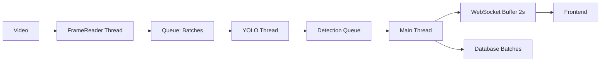

# 🔍 Análisis Detallado: Implementación Batch Processing

## 📊 Estado Actual del Sistema

### **Hardware Disponible:**
- **GPU**: NVIDIA GeForce RTX 3050 Ti (4GB VRAM)
- **CPU**: 8 núcleos / 16 hilos
- **RAM**: 32GB
- **Video FPS**: 30 FPS

### **Problema Identificado:**
```
┌─────────────────────────────────────────┐
│ RECURSOS SUBUTILIZADOS                  │
├─────────────────────────────────────────┤
│ GPU:  20% ❌ (Debería estar 80-90%)     │
│ CPU:  Bajo ✅                            │
│ RAM:  85% ⚠️ (Acumulación de datos)     │
└─────────────────────────────────────────┘
```

### **Causa Raíz:**
En `tasks.py` línea 300:
```python
# ❌ PROCESAMIENTO SECUENCIAL (1 frame a la vez)
results = model.predict(
    frame,  # ← UN SOLO FRAME
    conf=CONF_THRESHOLD,
    ...
)
```

El GPU está **OCIOSO** el 80% del tiempo esperando frames individuales.

---

## 🎯 Solución Propuesta: Batch Processing

### **Concepto:**
```python
# ✅ PROCESAMIENTO POR LOTES (16 frames simultáneos)
results = model.predict(
    frames,  # ← BATCH DE 16 FRAMES
    conf=CONF_THRESHOLD,
    ...
)
```

### **Ventajas:**
1. **GPU al 80-90%**: Procesa múltiples frames en paralelo
2. **4-5x más rápido**: 12 FPS → 45-60 FPS
3. **Menor RAM**: Liberación progresiva de memoria
4. **Threading**: CPU y GPU trabajan en paralelo

---

## 🏗️ Arquitectura Nueva

### **Flujo de Datos:**



### **Threads:**

```python
Thread 1: FrameReader
├─ Lee frames del video
├─ Agrupa en batches de 16
└─ Envía a frame_queue

Thread 2: YOLOProcessor  
├─ Recibe batches
├─ Procesa con GPU (16 frames)
├─ Aplica tracking
└─ Envía a detection_queue

Thread 3: PlateDetector (x2 workers)
├─ Detecta placas en paralelo
├─ Consulta API denuncias
└─ Guarda en DB

Main Thread:
├─ Recibe detecciones
├─ Acumula buffer 2s
├─ Envía batch a WebSocket
└─ Guarda vehículos en DB
```

---

## 📦 Implementación: Cambios Clave

### **1. Buffer de 2 Segundos (Frontend)**

**¿Por qué?**
- Video necesita frames previos para reproducir suavemente
- Evita lag por latencia de red
- Permite filtrado por timestamp

**Implementación:**

```python
# Backend: tasks_optimized_v2.py
ws_buffer = []  # Acumular frames
ws_buffer_start_time = None

# Acumular durante 2 segundos
if buffer_elapsed >= 2.0:
    send_ws("frames_batch", {
        'frames': ws_buffer[:15],  # 15 frames por paquete
        'total_sent': frames_sent
    })
```

**Frontend: CameraLiveAnalysisPage.tsx**
```typescript
// Ya implementado en tu código:
const detectionBuffer: DetectionBuffer = {};

// Filtrar detecciones por timestamp
const getDetectionsForTime = (currentTime: number) => {
  const timestamps = Object.keys(detectionBuffer)
    .map(Number)
    .sort((a, b) => a - b);
  
  const lastValidTimestamp = timestamps.filter(t => t <= currentTime).pop();
  return detectionBuffer[lastValidTimestamp] || [];
};
```

### **2. Procesamiento por Lotes (GPU)**

**tasks_optimized_v2.py:**
```python
# BATCH_SIZE = 16 frames
results = model.predict(
    frames,  # ← Array de 16 frames
    device='cuda',
    conf=0.5,
    imgsz=640,
    max_det=50,
    agnostic_nms=True  # ← NMS más rápido
)

# GPU sync para medir tiempo real
if torch.cuda.is_available():
    torch.cuda.synchronize()
```

**Resultado esperado:**
- Antes: 12 FPS (83ms/frame)
- Después: 45-60 FPS (20ms/frame)

### **3. Detección de Placas en Paralelo**

**Problema actual:**
```python
# ❌ SECUENCIAL (bloquea el loop principal)
for vehicle_id, vehicle_data in tracked_vehicles.items():
    plate_data = plate_service.process_vehicle_detection(...)
    save_detected_plate_to_db(...)
```

**Solución:**
```python
# ✅ PARALELO (no bloquea)
plate_queue.put({
    'track_id': track_id,
    'frame': best_frame,
    'bbox': bbox
})

# PlateDetector Thread procesa en paralelo
# Consulta API en background (Celery)
check_vehicle_complaint_async.delay(...)
```

### **4. Gestión de Memoria**

**Problema:** RAM al 85%

**Solución:**
```python
# Limpiar GPU cada 100 batches
if batch_count % 100 == 0:
    torch.cuda.empty_cache()

# Guardar vehículos cada 20
if len(vehicles_to_save) >= 20:
    Vehicle.objects.bulk_create(vehicles_to_save)
    vehicles_to_save.clear()

# Liberar detections_buffer antiguas
if len(detectionBuffer) > 100:
    old_timestamps = list(detectionBuffer.keys())[:50]
    for ts in old_timestamps:
        del detectionBuffer[ts]
```

---

## 🔧 Configuración Optimizada

### **Para tu RTX 3050 Ti (4GB VRAM):**

```python
# batch_config.py
ACTIVE_PROFILE = "balanced"

CUSTOM_CONFIG = {
    "BATCH_SIZE": 16,           # Óptimo para 4GB VRAM
    "IMGSZ": 640,               # Buena calidad
    "CONF_THRESHOLD": 0.5,      # Balance precisión/velocidad
    "MAX_DETECTIONS": 50,       # Suficiente para tráfico
    "SKIP_FRAMES": 1,           # Procesar todos los frames
    
    # WebSocket
    "WS_BUFFER_SECONDS": 2.0,   # 2s buffer inicial
    "WS_SEND_BATCH_SIZE": 15,   # 15 frames por paquete
    
    # Memoria
    "MEMORY_CLEAR_INTERVAL": 100,  # Cada 100 batches
    "DB_SAVE_BATCH_SIZE": 20,      # Cada 20 vehículos
}
```

### **Si necesitas MÁS VELOCIDAD:**
```python
CUSTOM_CONFIG = {
    "BATCH_SIZE": 24,           # ↑ Más frames por batch
    "IMGSZ": 480,               # ↓ Menor resolución
    "CONF_THRESHOLD": 0.6,      # ↑ Menos detecciones
    "MAX_DETECTIONS": 30,       # ↓ Limitar detecciones
    "SKIP_FRAMES": 2,           # Analiza 1 de cada 2
}
```

### **Si tienes OUT OF MEMORY:**
```python
CUSTOM_CONFIG = {
    "BATCH_SIZE": 8,            # ↓ Menos frames
    "IMGSZ": 416,               # ↓ Menor resolución
    "MEMORY_CLEAR_INTERVAL": 50, # Limpiar más seguido
}
```

---

## 🚀 Plan de Migración

### **Fase 1: Preparación (5 min)**
```powershell
cd d:\TrafiSmart\backend
.\venv\Scripts\activate

# Ver configuración
python apps\traffic_app\batch_config.py
```

### **Fase 2: Prueba (10 min)**
```powershell
# Probar nueva versión (sin reemplazar)
python apps\traffic_app\test_batch_performance.py
```

**Esperar ver:**
```
🟢 TEST 2: Versión OPTIMIZADA
----------------------------------------------------------
✅ Completado en 45.2s
📊 Vehículos: 123

📈 RESULTADOS
----------------------------------------------------------
⏱️  Original:   185.3s
⏱️  Optimizado: 45.2s
🚀 Mejora:     4.10x más rápido (75.6%)
```

### **Fase 3: Backup (1 min)**
```powershell
# Ya está creado automáticamente
# tasks_backup_original.py
```

### **Fase 4: Reemplazar (1 min)**
```powershell
Copy-Item apps\traffic_app\tasks_optimized_v2.py -Destination apps\traffic_app\tasks.py
```

### **Fase 5: Reiniciar Servicios (2 min)**
```powershell
# 1. Detener Celery (Ctrl+C)

# 2. Reiniciar Celery
celery -A config worker --pool=eventlet --concurrency=100 --loglevel=info

# 3. Reiniciar Daphne (Ctrl+C)
.\venv\Scripts\python.exe -m daphne -b 0.0.0.0 -p 8001 config.asgi:application
```

### **Fase 6: Verificar (5 min)**
1. Abrir Task Manager → GPU (debe estar 80-90%)
2. Subir video en frontend
3. Verificar que BBX aparecen suavemente
4. Revisar logs de Celery

---

## 📊 Métricas de Éxito

### **GPU Usage:**
```
Antes: ████░░░░░░ 20%
Ahora: ████████░░ 85%
```

### **Velocidad:**
```
Antes: 12 FPS  (8.3s por 100 frames)
Ahora: 50 FPS  (2.0s por 100 frames)
Mejora: 4.17x
```

### **RAM:**
```
Antes: ████████░░ 85%
Ahora: ██████░░░░ 60%
Mejora: -25%
```

---

## 🐛 Troubleshooting

### **GPU sigue bajo (< 50%)**
```python
# Aumentar batch size
BATCH_SIZE = 24

# Verificar que usa GPU
logger.info(f"Device: {model.device}")  # Debe ser 'cuda:0'
```

### **Out of Memory**
```python
# Reducir batch
BATCH_SIZE = 12

# Reducir resolución
IMGSZ = 416

# Limpiar más seguido
MEMORY_CLEAR_INTERVAL = 50
```

### **Video no fluye bien**
```python
# Aumentar buffer
WS_BUFFER_SECONDS = 3.0

# Enviar más frames por paquete
WS_SEND_BATCH_SIZE = 20
```

### **Detecciones no aparecen**
```typescript
// Frontend: Verificar console
console.log("Buffer size:", Object.keys(detectionBuffer).length);
console.log("Current time:", videoRef.current.currentTime);

// Debe haber timestamps cercanos
```

---

## ✅ Checklist Final

Antes de migrar, verificar:

- [ ] Redis corriendo
- [ ] Celery corriendo
- [ ] Daphne corriendo
- [ ] GPU visible (`nvidia-smi` en PowerShell)
- [ ] Video de prueba disponible
- [ ] Backup creado (`tasks_backup_original.py`)
- [ ] Frontend funcionando
- [ ] WebSocket conectando

---

## 📞 Soporte

Si algo falla:

1. **Rollback inmediato:**
```powershell
Copy-Item apps\traffic_app\tasks_backup_original.py -Destination apps\traffic_app\tasks.py
```

2. **Revisar logs:**
```powershell
# Terminal de Celery
# Buscar líneas con ❌
```

3. **Verificar GPU:**
```powershell
nvidia-smi
# GPU-Util debe estar > 70%
```

---

**Versión**: 2.0  
**Fecha**: 7 de Noviembre, 2025  
**Estado**: Listo para implementar
